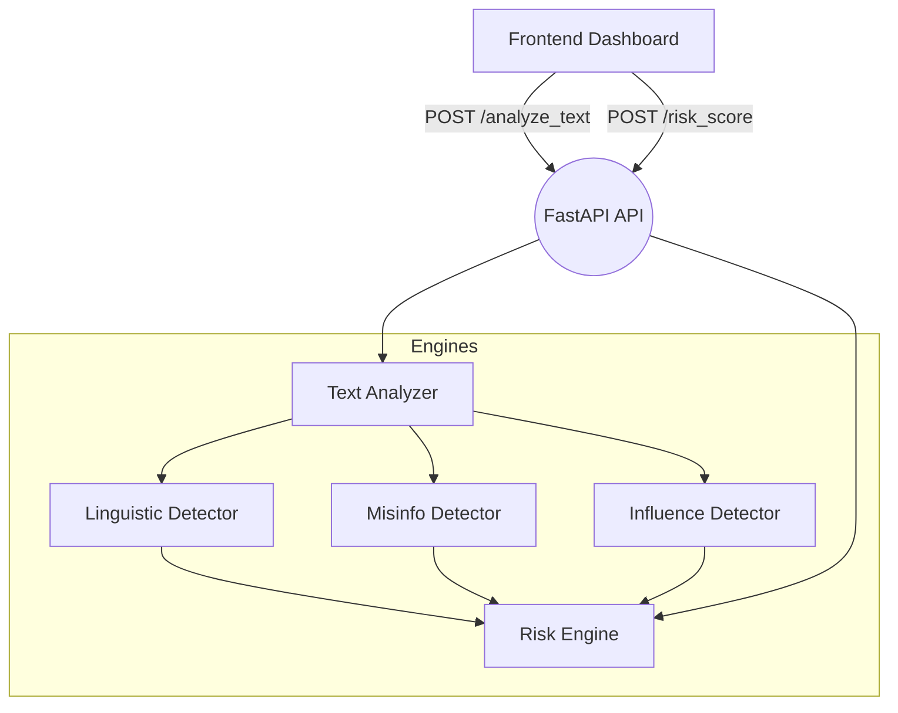

# Cognitive Security & Disinformation Analysis Dashboard

Synthetic, educational dashboard demonstrating how cognitive security teams could triage fictional content for manipulation, misinformation, and coordinated influence signals. **All data and outputs are synthetic and non-political.**

## At a Glance
- **FastAPI backend** with modular analysis engines and strong input validation.
- **Linguistic, misinformation, influence, and risk fusion** heuristics to illustrate cognitive security workflows.
- **Static dashboard** (HTML/JS/CSS) visualizing scores, clusters, and recommended actions.
- **Reporting utilities** for PDF export and synthetic visuals.
- **Safety first**: offline, synthetic-only processing—no real individuals or political content.

## Quickstart
1. Create a virtual environment and install dependencies:
   ```bash
   python -m venv .venv && source .venv/bin/activate
   pip install -r requirements.txt
   ```
2. Run the API locally:
   ```bash
   uvicorn backend.main:app --reload
   ```
3. Or start via Docker Compose:
   ```bash
   docker compose up --build
   ```
4. Open `frontend/index.html` in a browser. Ensure the API base URL matches your host/port (default `http://localhost:8000`).

## Architecture


## API Overview
Key endpoints (full reference in [`docs/API.md`](docs/API.md)):
- `POST /analyze_text` – Analyze synthetic text payloads and return embeddings plus linguistic & misinformation signals.
- `POST /analyze_image` – Base64 image input with simulated OCR to text.
- `POST /analyze_url` – Offline-simulated URL fetch with fictional content.
- `POST /risk_score` – Fuse multiple posts into a cognitive risk score with influence clustering.
- `GET /dashboard` – Dashboard readiness summary.
- `GET /health` – Health probe.

## Safety & Scope
- All analyses are **synthetic** and **fictional**; no real individuals or political content.
- URL handling is simulated; no external network calls are performed.
- Outputs are for **educational demos** of cognitive security concepts only.

## Project Layout
```
backend/
  api/           # FastAPI routers
  engines/       # Analysis engines
  utils/         # Shared utilities (logging, OCR stub, embeddings, visuals, pdf)
frontend/        # Static dashboard assets
models/          # Placeholder for synthetic artifacts
logs/            # Runtime logs
Dockerfile       # Production-ready container image
docker-compose.yml # Optional compose stack for local runs
Makefile         # Common developer commands
```

## Development
- Install dev tooling: `pip install -r requirements-dev.txt`
- Format: `black`, `isort`
- Lint: `ruff`
- Tests: `pytest`

### Running Tests & Checks
```bash
make lint
make test
```

### Developer Toolbox
- `make format` to auto-format (black, isort) and apply ruff fixes.
- `.editorconfig` to standardize editors/IDEs.
- Docker image includes `en_core_web_sm` so spaCy loads out of the box.

### Code Quality
- Type hints across modules.
- Centralized logging with rotation (`backend/utils/logger.py`).
- Input validation via Pydantic models at the API boundary.
- Synthetic-only data paths to prevent real-world targeting or data collection.

## Reporting & Governance
- PDF export available via `backend/utils/pdf_export.py`.
- Visual reports (heatmaps, timelines) written to `reports/` (auto-created when visuals run).
- Security posture and responsible-use guidelines in [`SECURITY.md`](SECURITY.md).
- Architecture & design rationale in [`docs/ARCHITECTURE.md`](docs/ARCHITECTURE.md).

## License
Released under the MIT License. See [LICENSE](LICENSE).
